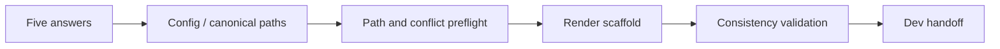

# USA Template Architecture

## Outcome

Read designated files → ask five answers including destination → review examples → clone into selected workspace → adapt files/plans → validate → ask appearance and wait. Convert product answers into a minimal, inspectable structural scaffold. Preserve responsibilities across different layouts. Product runtime implementation is outside this template.

## Program map

| Component | Actual path | Responsibility |
|---|---|---|
| Human entry | README.md | Thai quickstart, scope, usage |
| Agent entry | AGENTS.md / START_HERE_AGENT.md | action contract and workflow |
| Context index | MANIFEST.md | selective reading / canonical ownership |
| Role specification | docs/SIGNATURE.md | stable roles and dependency constraints |
| Generator | scripts/usa.py | parse config, preflight, render, write |
| Input examples | examples/*.json | five answers + optional path overrides |
| Verification | tests/test_usa.py | safety / consistency regression tests |
| CI | .github/workflows/validate.yml | test suite on Linux and Windows |
| Illustrations | assets/*.svg | original repository visuals |

## Mechanism

The generator contains no networking, installers or user-supplied command execution. init defaults to preview. --apply writes missing files with exclusive creation after complete conflict preflight. Equal content is left untouched. The operation is not transactional if an OS write fails; rerun identical config to complete missing files or inspect the isolated output.

## Generated system map

interface → application → domain. Infrastructure implements application ports and uses domain/contracts; domain must not depend on outer layers. Contracts define data boundaries. Tests observe behavior; operations support delivery; docs explain the map. The generator documents these constraints; code import enforcement belongs to the eventual stack.

Profiles: web, desktop, cli, service, data. `paths` overrides physical names; all role paths must be distinct/non-nested. Mobile and other layouts use overrides. Framework-native layout takes precedence when adapting an existing codebase.

## Data / integrations / operations

usa.project.json is generated canonical configuration. docs/PROJECT_BRIEF.md and ARCHITECTURE.md are derived views. No persistent application database, API or cloud deployment exists. No external account is required to run generation. Python >=3.10 is the only runtime for tooling.

## Risks

Symlink/path/conflict checks guard accidental writes, not hostile concurrent modification. ASCII folder segments make portable generated layouts conservative; project content supports Thai Unicode. Renaming a role path is a migration: generate into a fresh root and review changes. Generated view validation compares managed files only and allows developer additions.

## Verification / evolution

Run the commands in AGENTS.md. Changes to roles, config or rendering require tests and an ADR. Future runtime builds, dependency boundaries, auth and deployment must receive their own evidence. Last updated: 2026-10-08.

Credit: [Skeleton-BOI](https://github.com/wersoul-source/Skeleton-BOI)
