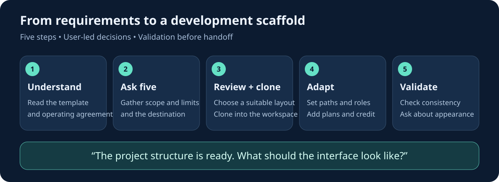
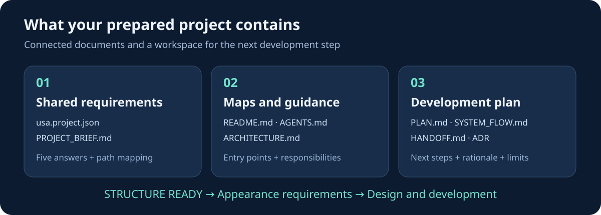
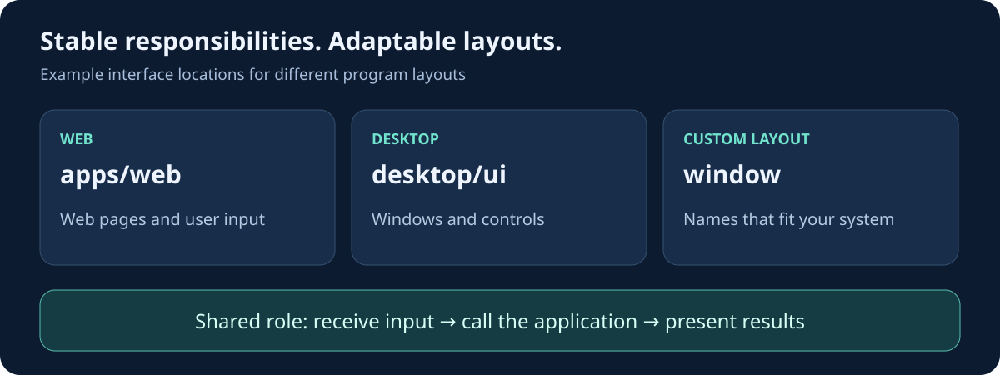

<p align="center">
  
</p>

# Skeleton-BOI

**A program structure template for starting a project with an AI agent**  
USA · Universal Structural Signature

**Language:** [ภาษาไทย](README.md) · **English**

Skeleton-BOI turns your requirements into a project scaffold with a clear architectural map. It begins with five essential questions, then guides an agent to prepare folders, documentation, and a development plan in your chosen workspace. This gives you and your developers a shared basis for the work ahead.

The core principle is to **adapt the physical layout to each program while preserving responsibilities and relationships**. You can use the template for web applications, desktop applications, CLI tools, API services, and data projects without requiring every project to use the same folder names.

<p align="center">
  <a href="START_HERE_AGENT.md">Agent starting point</a> ·
  <a href="ARCHITECTURE.md">Architecture map</a> ·
  <a href="examples/">Examples</a> ·
  <a href="docs/VALIDATION.md">Validation criteria</a>
</p>

## From requirements to a scaffold ready for development



| Step | What the agent does | What you receive |
|---|---|---|
| 1 · Understand | Reads the template guidance and operating agreement | A consistent approach to the project |
| 2 · Gather requirements | Asks five questions, including the destination and folder name | Recorded scope and constraints |
| 3 · Prepare the workspace | Reviews examples and clones the template into your chosen location | A template copy for your project |
| 4 · Adapt the structure | Updates folders, maps, documentation, and the development plan | A scaffold tailored to your requirements, with template credit |
| 5 · Validate and hand off | Checks consistency, reports the result, and asks about appearance | A starting point for UI design and implementation |

Once the scaffold has been prepared and validated, the agent asks:

> The project structure is ready. What would you like the program's interface to look like?

The agent then waits for your answer before starting interface design or the next implementation step. See [START_HERE_AGENT.md](START_HERE_AGENT.md) for the full operating workflow. The current agent contract uses the equivalent Thai completion message; this English README explains that same step.

## Getting started

You will need **Git**, **Python 3.10 or later**, and a coding agent that can read and edit files in your workspace. The scaffold tool uses Python's standard library, so no additional packages are required.

### Open the template with your agent

```sh
git clone https://github.com/wersoul-source/Skeleton-BOI.git
cd Skeleton-BOI
```

Open your coding agent in this folder. An agent that loads `AGENTS.md` receives instructions to begin the workflow. If your tool does not load that file automatically, use this prompt:

```text
Read AGENTS.md and START_HERE_AGENT.md, then begin the Skeleton-BOI workflow.
Ask the five initialization questions, including the destination and folder name.
Review the examples, clone into the selected location, and adapt the structure
and plan to the answers. Add template credit and validate the scaffold.
When complete, ask what the program's interface should look like.
```

Opening the GitHub page alone does not start an agent. A chat-based agent needs connected tools that can read the repository and write files before it can carry out the workflow.

### Create a copy through GitHub

You can also select **Use this template → Create a new repository** to create a copy in your account, then clone that copy. Open your agent and follow the workflow in `START_HERE_AGENT.md`.

## The five initialization questions

Each question helps the agent base the structure on your actual requirements. You may answer “not decided yet” where appropriate; the agent records those open points in the plan.

| No. | Topic | Question |
|---|---|---|
| 1 | Outcome | What is the program called, who will use it, what problem should it solve, and how will success be measured? |
| 2 | Surface | Should it be a web, desktop, mobile, CLI, service, or data application? Which systems must it run on, and does it need offline support? |
| 3 | Mechanism | What are its three to five main tasks? What are the inputs, processing steps, and outputs? Are external integrations required? |
| 4 | Constraints | Are there technologies, existing code, or paths to preserve? What constraints apply to data, permissions, budget, and security? |
| 5 | Execution | Where should the project be created, and what should the folder be named? What belongs in the first version, what is out of scope, how will it be accepted, and who will continue development? |

The agent asks these questions as one set and reuses information you have already provided. If the destination is still unspecified, it waits for that information before cloning or writing files.

## What your project receives



| File or component | Purpose |
|---|---|
| `usa.project.json` | Stores the five answers and the shared responsibility-to-path mapping |
| `README.md` | Introduces the project, starting instructions, and related documentation |
| `AGENTS.md` | Guides agents working in the initialized project, without repeating initialization |
| `ARCHITECTURE.md` | Maps components, responsibilities, and dependency direction |
| `PROJECT_BRIEF.md` | Summarizes the requirements from your answers |
| `PLAN.md` / `SYSTEM_FLOW.md` | Describes the development plan and the program's expected flow |
| `HANDOFF.md` / decision records | Records next steps, limitations, and the rationale for structural decisions |
| Responsibility-based folders | Provides locations for interfaces, business rules, integrations, tests, and documentation |

Planning documents live under the path selected for the `docs` responsibility. Key scaffold documents include a credit link back to Skeleton-BOI.

The delivered scaffold is **a starting point for development**. Product functionality, framework setup, and application acceptance testing follow in later work. This English edition covers the README and its illustrations; shared operating documents, examples, and generated project text retain their existing language.

## Stable responsibilities, adaptable paths



Folder names may change to fit the system or framework. For example, an interface can live in `apps/web`, `desktop/ui`, or `window` while retaining its responsibility for receiving input and presenting output.


| Responsibility | What it owns | Web example | Desktop example |
|---|---|---|---|
| interface | Input and output | `apps/web` | `desktop/ui` |
| application | Use-case orchestration and ports | `src/application` | `desktop/application` |
| domain | Business rules and invariants | `src/domain` | `desktop/domain` |
| infrastructure | Database, operating-system, and external-service adapters | `src/infrastructure` | `desktop/adapters` |
| contracts | Data agreements and interfaces | `contracts` | `contracts` |
| tests | Behavior and acceptance evidence | `tests` | `tests` |
| operations | Configuration, delivery, and recovery | `ops` | `ops` |
| docs | Maps, rationale, and handoff information | `docs` | `docs` |

For mobile projects, start with the desktop profile and override paths to match the framework. For existing projects, map responsibilities onto the current structure before deciding to move files. See [SIGNATURE.md](docs/SIGNATURE.md) and [ARCHITECTURE.md](ARCHITECTURE.md).

## Try generating a scaffold yourself

This example creates a desktop scaffold in a new folder, starting with a preview of the files to be written:

```sh
python scripts/usa.py init --config examples/desktop.json --output generated/my-desktop
python scripts/usa.py init --config examples/desktop.json --output generated/my-desktop --apply
python scripts/usa.py validate --root generated/my-desktop
```

The configurations in `examples/` contain demonstration requirements. For a real project, enter your answers, set the project name, and adjust responsibility paths as needed, such as `"interface": "window"`. Use relative paths separated by `/`.

In the agent workflow, the scaffold is generated in a separate staging directory before it is inspected and brought into the clone with a reviewable diff. The tool refuses to overwrite existing files with different content.

## Validation and preservation of existing work

The tool previews changes before writing. It rejects paths that escape the destination, overlapping responsibility folders, and symlinks in generated paths. If an existing file has different content, it stops for review instead of overwriting it automatically.

```sh
python -m unittest discover -s tests -v
```

These checks cover scaffold tooling and document consistency. Product builds, behavior tests, integration tests, and acceptance checks must be added for the chosen technology and the criteria agreed in question five. A passing scaffold check does not establish application or production readiness.

Keep credentials and private data outside the repository. The generator does not install packages, deploy services, or execute commands embedded in answers. See [VALIDATION.md](docs/VALIDATION.md) for the validation contract.

## Guide to the template documents

| Topic | Starting document |
|---|---|
| Agent workflow | [START_HERE_AGENT.md](START_HERE_AGENT.md) |
| Operating agreement | [AGENTS.md](AGENTS.md) |
| Program and tooling map | [ARCHITECTURE.md](ARCHITECTURE.md) |
| Context-loading order | [MANIFEST.md](MANIFEST.md) |
| Stable structural responsibilities | [SIGNATURE.md](docs/SIGNATURE.md) |
| Initialization states and rules | [INITIALIZATION.md](docs/INITIALIZATION.md) |
| Contributing improvements | [CONTRIBUTING.md](CONTRIBUTING.md) |

## References and licensing

USA is the name of this project's approach. It adapts ideas from [AGENTS.md](https://agents.md/), [ARCHITECTURE.md](https://architecture.md/), [ReadMe](https://readme.com/), [Manifest](https://readthemanifest.net/), [AI-First SSOT](https://github.com/artificial-intelligence-first/ssot), and [MIT CommKit](https://mitcommlab.mit.edu/broad/commkit/file-structure/). See [SOURCES.md](docs/SOURCES.md) for summaries and the scope of the source review.

Released under the [MIT License](LICENSE). You may use, adapt, and distribute the template under its license terms. The five SVG illustrations shown in this README were created for the project.

Credit: [Skeleton-BOI](https://github.com/wersoul-source/Skeleton-BOI)
