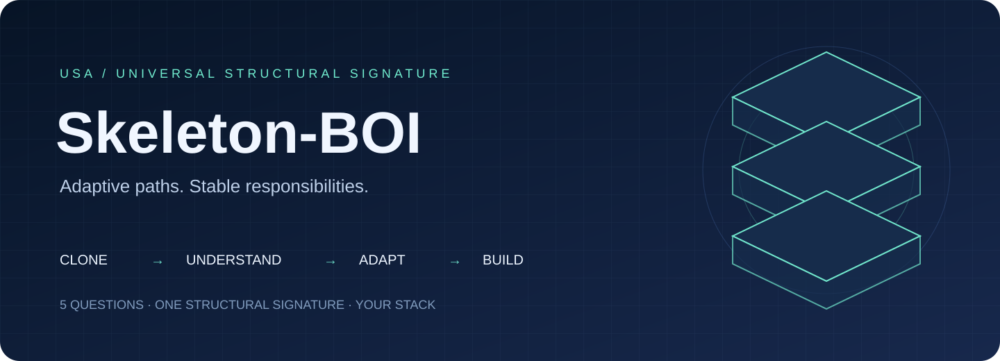
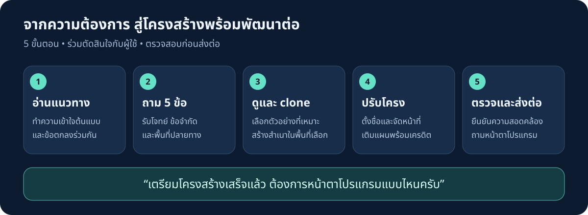
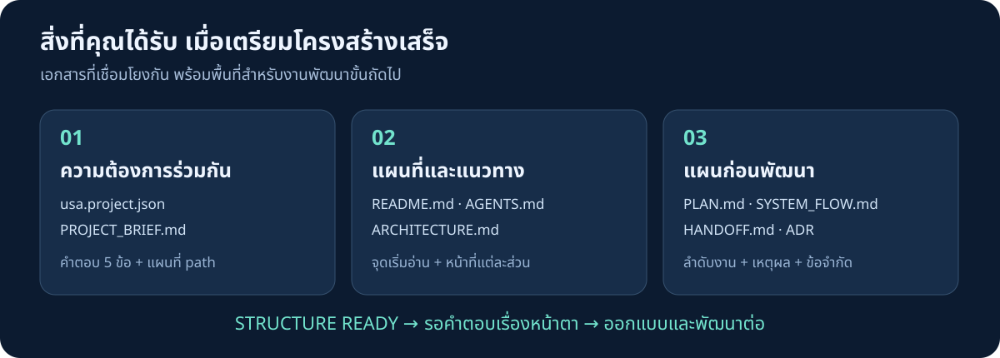
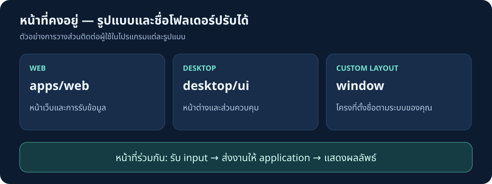
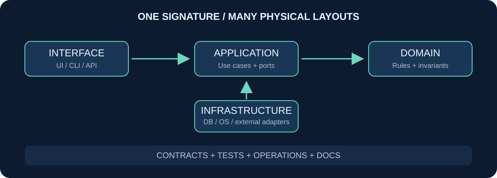

<p align="center">
  
</p>

# Skeleton-BOI

**ต้นแบบโครงสร้างโปรแกรมสำหรับเริ่มงานร่วมกับ AI Agent**  
USA · Universal Structural Signature

**ภาษา:** **ไทย** · [English](README.en.md)

Skeleton-BOI ช่วยเปลี่ยนความต้องการของคุณให้เป็นโครงสร้างโครงการที่มีแผนที่ชัดเจน เริ่มจากคำถามสำคัญ 5 ข้อ แล้วให้ Agent จัดเตรียมโฟลเดอร์ เอกสาร และแผนล่วงหน้าในพื้นที่ที่คุณเลือก เพื่อให้คุณและนักพัฒนาสามารถทำงานต่อได้อย่างเข้าใจตรงกัน

แนวคิดหลักคือ **ปรับรูปแบบให้เหมาะกับแต่ละโปรแกรม โดยรักษาหน้าที่และความสัมพันธ์ของส่วนต่าง ๆ** คุณจึงเลือกใช้กับเว็บ แอปเดสก์ท็อป เครื่องมือ CLI บริการ API หรือโครงการข้อมูลได้ โดยไม่จำเป็นต้องใช้ชื่อโฟลเดอร์เดียวกันทั้งหมด

<p align="center">
  <a href="START_HERE_AGENT.md">เริ่มต้นสำหรับ Agent</a> ·
  <a href="ARCHITECTURE.md">ดูแผนที่โครงสร้าง</a> ·
  <a href="examples/">ดูตัวอย่าง</a> ·
  <a href="docs/VALIDATION.md">เกณฑ์ตรวจสอบ</a>
</p>

## จากความต้องการ สู่โครงสร้างพร้อมพัฒนาต่อ



| ขั้นตอน | สิ่งที่ Agent ดำเนินการ | สิ่งที่คุณได้รับ |
|---|---|---|
| 1 · ทำความเข้าใจ | อ่านไฟล์แนวทางและข้อตกลงของต้นแบบ | แนวทางการทำงานที่สอดคล้องกัน |
| 2 · รับความต้องการ | ถาม 5 ข้อ รวมพื้นที่ปลายทางและชื่อโฟลเดอร์ | ขอบเขตโครงการและข้อจำกัดที่บันทึกไว้ |
| 3 · เตรียมพื้นที่ | ดูตัวอย่าง แล้ว clone ไปยังพื้นที่ที่คุณเลือก | สำเนาต้นแบบสำหรับโครงการของคุณ |
| 4 · ปรับโครงสร้าง | ปรับชื่อโฟลเดอร์ แผนที่ เอกสาร และแผนล่วงหน้า | โครงสร้างที่สัมพันธ์กับโจทย์ พร้อมเครดิตต้นแบบ |
| 5 · ตรวจและส่งต่อ | ตรวจความสอดคล้อง แจ้งผล และถามเรื่องหน้าตา | จุดเริ่มต้นสำหรับออกแบบ UI และพัฒนาต่อ |

เมื่อจัดเตรียมโครงสร้างและตรวจสอบเรียบร้อย Agent จะลงท้ายว่า:

> เตรียมโครงสร้างเสร็จแล้ว ต้องการหน้าตาโปรแกรมแบบไหนครับ

จากนั้นจึงรอคำตอบของคุณก่อนเริ่มงานด้านหน้าตาหรือการพัฒนาขั้นถัดไป อ่านรายละเอียดการปฏิบัติงานใน [START_HERE_AGENT.md](START_HERE_AGENT.md)

## เริ่มใช้งาน

เตรียม **Git**, **Python 3.10 ขึ้นไป** และ coding Agent ที่สามารถอ่านและแก้ไขไฟล์ในพื้นที่ทำงานได้ เครื่องมือสร้างโครงใช้ไลบรารีมาตรฐานของ Python จึงไม่ต้องติดตั้งแพ็กเกจเพิ่มเติม

### เปิดต้นแบบให้ Agent

```sh
git clone https://github.com/wersoul-source/Skeleton-BOI.git
cd Skeleton-BOI
```

เปิด coding Agent ในโฟลเดอร์นี้ Agent ที่โหลด `AGENTS.md` จะได้รับแนวทางให้เริ่ม workflow โดยอัตโนมัติ หากเครื่องมือของคุณไม่โหลดไฟล์ดังกล่าว ให้ใช้ข้อความนี้:

```text
อ่าน AGENTS.md และ START_HERE_AGENT.md แล้วเริ่ม workflow Skeleton-BOI
ถามความต้องการ 5 ข้อ รวมพื้นที่ปลายทางและชื่อโฟลเดอร์
ดูตัวอย่างแล้ว clone ไปยังพื้นที่ที่เลือก ปรับโครงสร้างและแผนให้ตรงคำตอบ
ใส่เครดิต ตรวจสอบ และเมื่อเสร็จแล้วถามว่าต้องการหน้าตาโปรแกรมแบบไหน
```

การเปิดหน้า GitHub เพียงอย่างเดียวไม่ได้เรียกใช้ Agent สำหรับ Agent แบบแชต ต้องเชื่อมเครื่องมือที่อ่าน repo และเขียนไฟล์ได้ก่อนเริ่มงาน

### สร้างสำเนาผ่าน GitHub

คุณสามารถเลือก **Use this template → Create a new repository** เพื่อสร้างสำเนาในบัญชีของคุณ แล้ว clone สำเนานั้นได้เช่นกัน จากนั้นเปิด Agent และดำเนินการตามขั้นตอนใน START_HERE_AGENT.md

## คำถามตั้งต้น 5 ข้อ

คำถามแต่ละข้อช่วยให้ Agent วางโครงสร้างจากความต้องการจริง คุณสามารถตอบว่า “ยังไม่ทราบ” ในส่วนที่ยังไม่ได้ตัดสินใจ โดย Agent จะบันทึกประเด็นนั้นไว้ในแผน

| ข้อ | ประเด็น | คำถาม |
|---|---|---|
| 1 | เป้าหมาย · Outcome | โปรแกรมชื่ออะไร ใครเป็นผู้ใช้ ต้องการแก้ปัญหาใด และจะวัดผลสำเร็จอย่างไร? |
| 2 | รูปแบบ · Surface | ต้องการ Web, Desktop, Mobile, CLI, Service หรือ Data ใช้งานบนระบบใด และต้องรองรับการทำงานออฟไลน์หรือไม่? |
| 3 | การทำงาน · Mechanism | งานหลัก 3–5 อย่างมีอะไรบ้าง ข้อมูลเข้า ขั้นตอน และผลลัพธ์เป็นอย่างไร มีบริการภายนอกที่ต้องเชื่อมต่อหรือไม่? |
| 4 | ข้อจำกัด · Constraints | มีเทคโนโลยี โค้ดเดิม หรือ path ที่ต้องรักษาหรือไม่ รวมถึงข้อจำกัดเรื่องข้อมูล สิทธิ์ งบประมาณ และความปลอดภัย? |
| 5 | การส่งมอบ · Execution | ต้องการสร้างในพื้นที่ใด ใช้ชื่อโฟลเดอร์อะไร ขอบเขตเวอร์ชันแรก สิ่งที่ยังไม่ทำ เกณฑ์ตรวจรับ และผู้รับช่วงพัฒนาคืออะไร? |

Agent ถามเป็นชุดเดียวและใช้ข้อมูลที่คุณให้ไว้แล้ว หากยังไม่ระบุพื้นที่ปลายทาง Agent จะรอข้อมูลส่วนนี้ก่อน clone หรือเขียนไฟล์

## สิ่งที่เตรียมให้ในโครงการของคุณ



| ไฟล์หรือส่วนงาน | หน้าที่ |
|---|---|
| `usa.project.json` | เก็บคำตอบ 5 ข้อและแผนที่หน้าที่ → path ที่ใช้อ้างอิงร่วมกัน |
| `README.md` | อธิบายโครงการ วิธีเริ่มต้น และลิงก์ไปยังเอกสารที่เกี่ยวข้อง |
| `AGENTS.md` | แนวทางสำหรับ Agent ในโครงการที่ตั้งต้นแล้ว ช่วยให้ทำงานต่อโดยไม่ถามเริ่มต้นซ้ำ |
| `ARCHITECTURE.md` | แผนที่องค์ประกอบ หน้าที่ และทิศทางการเชื่อมโยง |
| `PROJECT_BRIEF.md` | สรุปความต้องการจากคำตอบของคุณ |
| `PLAN.md` / `SYSTEM_FLOW.md` | แผนก่อนพัฒนาและลำดับการทำงานของโปรแกรม |
| `HANDOFF.md` / บันทึกการตัดสินใจ | ประเด็นที่ต้องทำต่อ ข้อจำกัด และเหตุผลในการเลือกโครงสร้าง |
| โฟลเดอร์ตามหน้าที่ | พื้นที่สำหรับส่วนติดต่อผู้ใช้ กฎธุรกิจ การเชื่อมระบบ การทดสอบ และเอกสาร |

เอกสารวางแผนอยู่ภายใต้ path ที่เลือกสำหรับหน้าที่ `docs` และเอกสารโครงสร้างสำคัญมีเครดิตลิงก์กลับมายัง Skeleton-BOI

โครงสร้างที่ส่งมอบเป็น **จุดตั้งต้นสำหรับการพัฒนา** ส่วนฟังก์ชันจริง การติดตั้งเทคโนโลยีของผลิตภัณฑ์ และการตรวจรับแอปจะดำเนินการในขั้นถัดไป

## โครงสร้างเดียวกัน ปรับชื่อและพื้นที่ได้



ชื่อโฟลเดอร์สามารถเปลี่ยนตามระบบหรือ framework ที่ใช้ เช่น ส่วนติดต่อผู้ใช้อาจอยู่ใน `apps/web`, `desktop/ui` หรือ `window` โดยยังมีหน้าที่รับข้อมูลและแสดงผลเช่นเดิม



| หน้าที่ | ความรับผิดชอบ | ตัวอย่าง Web | ตัวอย่าง Desktop |
|---|---|---|---|
| interface | รับข้อมูลและแสดงผล | `apps/web` | `desktop/ui` |
| application | จัดลำดับงานและกำหนดจุดเชื่อมต่อ | `src/application` | `desktop/application` |
| domain | กฎธุรกิจและเงื่อนไขที่ต้องรักษา | `src/domain` | `desktop/domain` |
| infrastructure | เชื่อมฐานข้อมูล ระบบปฏิบัติการ และบริการภายนอก | `src/infrastructure` | `desktop/adapters` |
| contracts | ข้อตกลงข้อมูลและ interface | `contracts` | `contracts` |
| tests | ตรวจพฤติกรรมและเกณฑ์รับงาน | `tests` | `tests` |
| operations | การตั้งค่า ส่งมอบ และกู้คืน | `ops` | `ops` |
| docs | แผนที่ เหตุผล และเอกสารส่งต่อ | `docs` | `docs` |

สำหรับ Mobile สามารถเริ่มจาก desktop profile และปรับ paths ให้ตรงโครงของ framework ส่วนโครงการเดิมควร map หน้าที่เข้ากับโครงที่มีอยู่ก่อนตัดสินใจย้ายไฟล์ รายละเอียดอยู่ใน [SIGNATURE.md](docs/SIGNATURE.md) และ [ARCHITECTURE.md](ARCHITECTURE.md)

## ทดลองสร้างโครงด้วยตนเอง

ตัวอย่างนี้สร้างโครง Desktop ในโฟลเดอร์ใหม่ โดยเริ่มจากดูรายการไฟล์ก่อนเขียน:

```sh
python scripts/usa.py init --config examples/desktop.json --output generated/my-desktop
python scripts/usa.py init --config examples/desktop.json --output generated/my-desktop --apply
python scripts/usa.py validate --root generated/my-desktop
```

ตัวอย่างใน `examples/` เป็นข้อมูลสาธิต เมื่อใช้กับโครงการจริง ให้กรอกคำตอบของคุณ ตั้งชื่อโครงการ และปรับ role paths ตามความต้องการ เช่น `"interface": "window"` ใช้ relative path คั่นด้วย `/`

สำหรับ workflow ของ Agent จะสร้างโครงในพื้นที่พักแยกจาก clone ก่อนตรวจและนำไฟล์เข้ามาอย่างมี diff เพราะเครื่องมือป้องกันการเขียนทับไฟล์ที่มีเนื้อหาต่างกัน

## การตรวจสอบและการรักษางานเดิม

เครื่องมือแสดงรายการก่อนเขียน ปฏิเสธ path ที่ออกนอกพื้นที่ โฟลเดอร์ซ้อนกัน และ symlink ในเส้นทางที่สร้าง หากพบไฟล์ชื่อเดียวกันแต่เนื้อหาต่างกัน จะหยุดให้ตรวจสอบก่อน ไม่เขียนทับโดยอัตโนมัติ

```sh
python -m unittest discover -s tests -v
```

การตรวจนี้ครอบคลุมเครื่องมือสร้างโครงและความสอดคล้องของเอกสาร ส่วน build, behavior tests, integration tests และการตรวจรับผลิตภัณฑ์ต้องเพิ่มตามเทคโนโลยีและเกณฑ์ที่ตกลงในข้อ 5 ผลตรวจโครงไม่ได้ยืนยันว่าแอปพร้อมใช้งานจริงหรือพร้อม production

เก็บ credentials และข้อมูลส่วนตัวแยกจาก repository เครื่องมือสร้างโครงไม่ติดตั้งแพ็กเกจ ไม่ deploy และไม่รันคำสั่งที่แฝงมาในคำตอบ อ่านเกณฑ์เพิ่มเติมใน [VALIDATION.md](docs/VALIDATION.md)

## คู่มือภายในต้นแบบ

| ต้องการศึกษาเรื่องใด | เริ่มอ่านจาก |
|---|---|
| ขั้นตอนสำหรับ Agent | [START_HERE_AGENT.md](START_HERE_AGENT.md) |
| ข้อตกลงการทำงาน | [AGENTS.md](AGENTS.md) |
| แผนที่โปรแกรมและเครื่องมือ | [ARCHITECTURE.md](ARCHITECTURE.md) |
| ลำดับการโหลดข้อมูลประกอบ | [MANIFEST.md](MANIFEST.md) |
| แนวคิดหน้าที่ที่คงอยู่ | [SIGNATURE.md](docs/SIGNATURE.md) |
| สถานะและขั้นตอนตั้งต้น | [INITIALIZATION.md](docs/INITIALIZATION.md) |
| การเสนอปรับปรุงต้นแบบ | [CONTRIBUTING.md](CONTRIBUTING.md) |

## แนวคิดอ้างอิงและสิทธิ์การใช้งาน

USA เป็นชื่อแนวทางของโครงการนี้ นำแนวคิดจาก [AGENTS.md](https://agents.md/), [ARCHITECTURE.md](https://architecture.md/), [ReadMe](https://readme.com/), [Manifest](https://readthemanifest.net/), [AI-First SSOT](https://github.com/artificial-intelligence-first/ssot) และ [MIT CommKit](https://mitcommlab.mit.edu/broad/commkit/file-structure/) มาประยุกต์ใช้ ดูสรุปและขอบเขตการศึกษาใน [SOURCES.md](docs/SOURCES.md)

เผยแพร่ภายใต้ [MIT License](LICENSE) สามารถใช้ ปรับ และแจกจ่ายตามเงื่อนไขของใบอนุญาต ภาพ SVG ทั้ง 5 ภาพจัดทำขึ้นสำหรับโครงการนี้

Credit: [Skeleton-BOI](https://github.com/wersoul-source/Skeleton-BOI)
